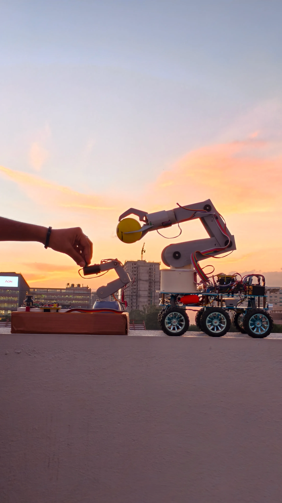
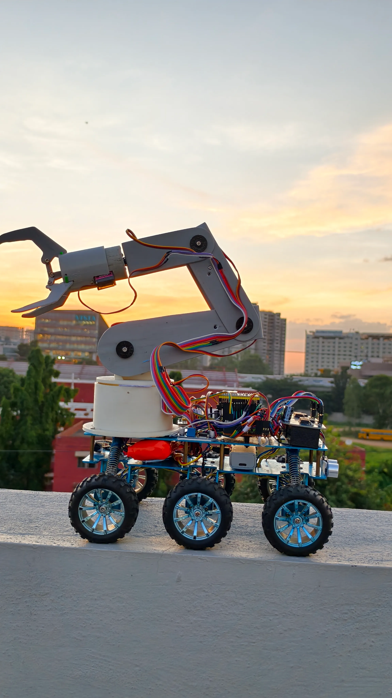
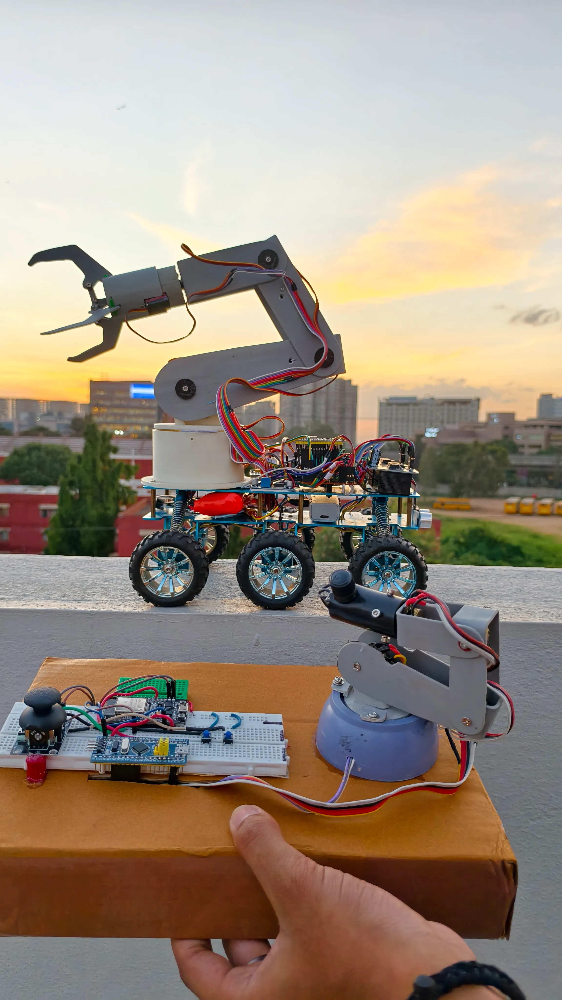

# Mobile Robotic Manipulator

<p align="center">

</p>

<p align="center">


</p>

A **6-DOF Mobile Robotic Manipulator** combining a six-wheel unmanned ground vehicle (UGV) with a six-degree-of-freedom robotic arm for wireless control, embedded robotics research, and object manipulation.

Designed, engineered, programmed, assembled, tested, and documented entirely by **Aman Sharma**.

---

# Overview

The Mobile Robotic Manipulator has been developed as a modular robotics platform that integrates:

- 6-Wheel Differential Drive Rover
- 6-DOF Robotic Manipulator
- ESP32 Wireless Communication
- Wi-Fi Control
- ESP-NOW Control
- Motion Control
- Real-Time Embedded Firmware
- Modular Hardware Architecture
- Robotics Research Platform

Each subsystem has been designed and tested independently before complete system integration.

---

# Features

- Six-wheel mobile robot
- Six-degree-of-freedom robotic arm
- Wireless ESP-NOW communication
- Wi-Fi based control
- MPU6050 orientation tracking
- OLED status display
- HC-SR04 obstacle detection
- PCA9685 servo controller
- Modular firmware architecture
- Comprehensive documentation

---

# Hardware

- ESP32 Development Board
- NodeMCU-32S ESP32
- STM32F103 Blue Pill
- PCA9685 Servo Driver
- MPU6050 IMU
- HC-SR04 Ultrasonic Sensor
- SSD1306 OLED
- IBT-2 Motor Drivers
- MG996R Servo Motors
- MG90S Servo Motors
- Lithium Battery System

---


Mobile-Robotic-Manipulator/
│
├── assets/
│   └── images/
│       ├── angle-view.webp
│       ├── both1.webp
│       ├── close-arm.webp
│       ├── grip.webp
│       ├── main.webp
│       ├── manipulator.webp
│       ├── setup.webp
│       ├── side-view.webp
│       ├── soldering.webp
│       ├── ultrasonic.webp
│       └── wires.webp
│
├── docs/
│   ├── bill-of-materials.md
│   ├── build-guide.md
│   ├── development-roadmap.md
│   ├── hardware.md
│   ├── power-system.md
│   ├── troubleshooting.md
│   └── wiring.md
│
├── firmware/
│   ├── ESP-NOW/
│   │   ├── receiver.ino
│   │   └── transmitter.ino
│   │
│   ├── tests/
│   │   ├── mpu-orientation-test.ino
│   │   ├── processing-code.pde
│   │   └── steps.md
│   │
│   └── wifi-control/
│       ├── mobile-robotic-manipulator.ino
│       └── steps.md
│
├── README.md
└── .gitignore


# Repository Structure

```text
(Updated repository structure here)
```

---

# Documentation

| Document | Description |
|----------|-------------|
| Hardware | Hardware overview |
| Wiring | Complete wiring guide |
| Build Guide | Assembly instructions |
| Power System | Power architecture |
| Bill of Materials | Components list |
| Troubleshooting | Common issues |
| Development Roadmap | Future plans |

---

# Firmware

### ESP-NOW

- Receiver firmware
- Transmitter firmware

### Wi-Fi Control

- Complete mobile robot control firmware

### Tests

- MPU6050 orientation test
- Processing 3D visualizer

---

# Gallery

<p align="center">




<br><br>




</p>

---

# Project Status

🟢 Active Development

Current repository includes:

- Wi-Fi Control
- ESP-NOW Firmware
- Hardware Documentation
- Wiring Documentation
- MPU6050 Testing
- Processing 3D Visualizer

Additional firmware, documentation, hardware improvements, and new features will continue to be added as development progresses.

---

# Notice

This repository is **not open source**.

The complete hardware architecture, firmware, software, documentation, mechanical design, and system integration are original work created solely by **Aman Sharma**.

Please do not copy, redistribute, or reproduce any part of this project without prior permission.

---

# Author

## Aman Sharma

Embedded Systems • Robotics • Mechatronics • Computer Vision
