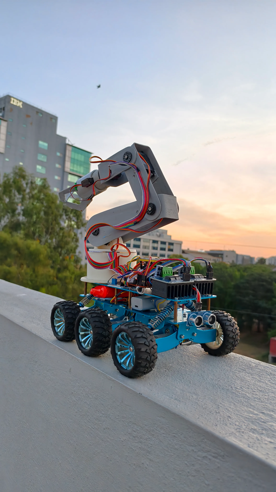
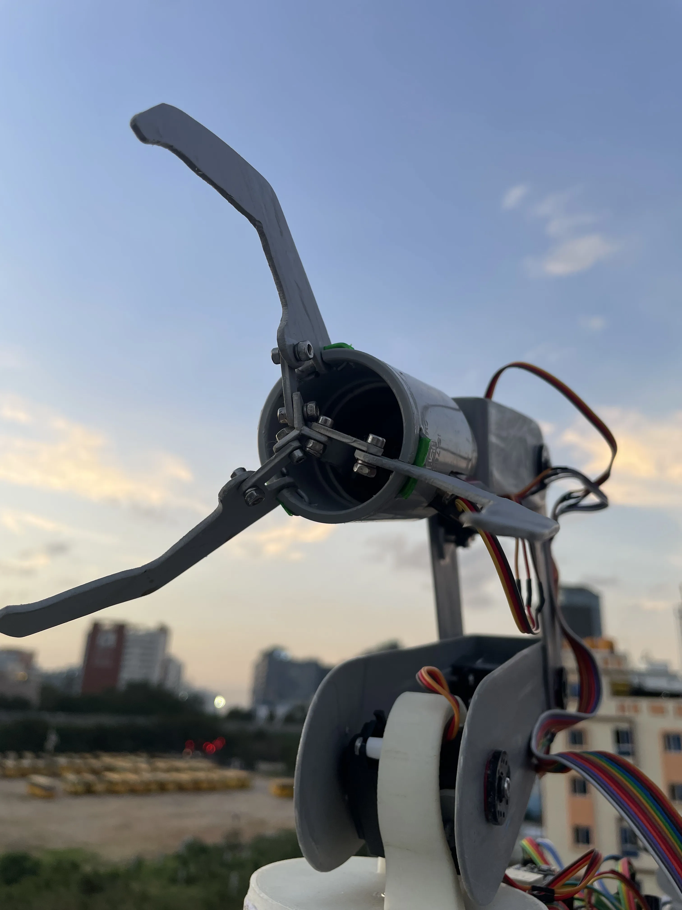
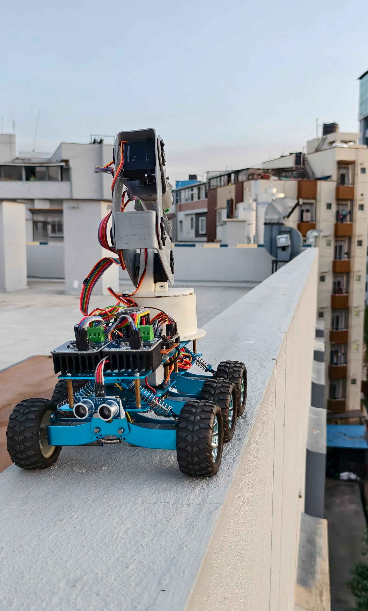

# Mobile Robotic Manipulator

<table>
<tr>
<td width="42%">


</td>

<td width="58%">

## 6-DOF Mobile Robotic Manipulator

A modular robotics platform combining a **6-wheel unmanned ground vehicle (UGV)** with a **6-degree-of-freedom robotic manipulator** for wireless control, embedded systems research, autonomous experimentation, and object manipulation.

Designed, engineered, programmed, assembled, tested, and documented entirely by **Aman Sharma**.

### Current Features

- 6-Wheel Differential Drive Rover
- 6-DOF Robotic Arm
- ESP-NOW Communication
- Wi-Fi Control
- MPU6050 Orientation Tracking
- OLED Status Display
- Modular Embedded Firmware

</td>
</tr>
</table>

<p align="center">


</p>

---

# Overview

The **Mobile Robotic Manipulator** is a self-designed robotics platform that integrates a six-wheel mobile robot with a six-degree-of-freedom robotic arm into a single modular system. The project focuses on embedded systems, wireless communication, robotic manipulation, and autonomous mobile robotics.

Every subsystem—including the mechanical assembly, electronics integration, embedded firmware, communication protocols, documentation, and testing—has been developed from the ground up as part of a continuous engineering project.

---

# Features

- Six-wheel differential drive mobile platform
- Six-degree-of-freedom robotic manipulator
- ESP32-based wireless communication
- ESP-NOW low-latency control
- Wi-Fi browser-based control
- MPU6050 orientation sensing
- OLED status display
- HC-SR04 obstacle detection
- PCA9685 servo controller
- Modular firmware architecture
- Expandable hardware platform
- Comprehensive documentation

---

# Hardware

- ESP32 Development Boards
- NodeMCU-32S ESP32
- STM32F103 Blue Pill
- PCA9685 Servo Driver
- MPU6050 IMU
- HC-SR04 Ultrasonic Sensor
- SSD1306 OLED Display
- IBT-2 Motor Drivers
- MG996R Servo Motors
- MG90S Servo Motors
- Lithium Battery Power System

---

# Repository Structure

```text
Mobile-Robotic-Manipulator/
│
├── assets/
│   └── images/
│       ├── angle-view.webp
│       ├── both1.webp
│       ├── close-arm.webp
│       ├── grip.webp
│       ├── main.webp
│       ├── manipulator.webp
│       ├── setup.webp
│       ├── side-view.webp
│       ├── soldering.webp
│       ├── ultrasonic.webp
│       └── wires.webp
│
├── docs/
│   ├── bill-of-materials.md
│   ├── build-guide.md
│   ├── development-roadmap.md
│   ├── hardware.md
│   ├── power-system.md
│   ├── troubleshooting.md
│   └── wiring.md
│
├── firmware/
│   ├── ESP-NOW/
│   │   ├── receiver.ino
│   │   └── transmitter.ino
│   │
│   ├── tests/
│   │   ├── mpu-orientation-test.ino
│   │   ├── processing-code.pde
│   │   └── steps.md
│   │
│   └── wifi-control/
│       ├── mobile-robotic-manipulator.ino
│       └── steps.md
│
├── README.md
└── .gitignore
```

---

# Documentation

| Document | Description |
|----------|-------------|
| **hardware.md** | Hardware overview and components |
| **wiring.md** | Complete transmitter and receiver wiring |
| **build-guide.md** | Mechanical assembly guide |
| **power-system.md** | Battery and power distribution |
| **bill-of-materials.md** | Complete component list |
| **troubleshooting.md** | Common issues and fixes |
| **development-roadmap.md** | Upcoming features and milestones |

---

# Firmware

### ESP-NOW

- Receiver firmware
- Transmitter firmware

### Wi-Fi Control

- Browser-based mobile robot control firmware

### Tests

- MPU6050 orientation test
- Processing 3D orientation visualizer

---

# Project Gallery

<p align="center">






</p>

---

# Project Status

🟢 **Active Development**

Currently available in this repository:

- ESP-NOW Communication Firmware
- Wi-Fi Control Firmware
- MPU6050 Orientation Test
- Processing 3D Visualizer
- Complete Hardware Documentation
- Wiring Documentation
- Bill of Materials
- Build Guide
- Development Roadmap
- Troubleshooting Guide

Additional firmware, hardware improvements, documentation, and new features will continue to be added as the project evolves.

---

# Author

**Aman Sharma**

**Embedded Systems • Robotics • Mechatronics • Computer Vision**

---

# Notice

This project is **not open source**.

The complete hardware architecture, firmware, electronics, documentation, mechanical integration, software, and overall system design are original work created solely by **Aman Sharma**.

Please do not copy, redistribute, or reproduce any part of this project without prior permission.